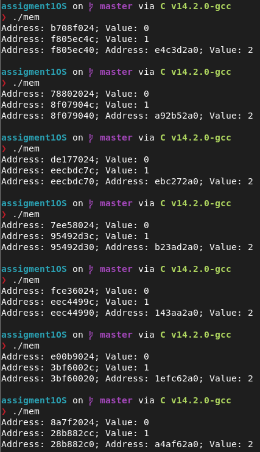

# Assignment 01: Process abstraction
Github link: [www.github.com](
	https://github.com/HeyItsAp/Kernel_abstraction_OS)

## 01 The process abstraction
A process is a step by step execution av a program with restricted rights controlled by the kernel.
The program usually rests "on top" of the kernel and is dependent on user-level priviliges. Kernel-level operations are step deeper.
Even so a process usually needs permissions from the kernel for most basic function. Such as accessing memory of any prcess, reading and writing to the disk and hardware settings.
That means it has to go from user-level to kernel-level for priviliged instructions. It goes up back again after said system call for a certain function, and also on interrupts/execeptions, implemented up-calls and on a new porcess.
  
### Code 
```c
#include <stdio.h>
#include <stdlib.h>
#include <string.h>

int main(int argc, char const *argv[]){
	int x;
	if (argc > 1){
		x = atoi(argv[1]);	
	} else {
		exit(1);
	}
	char word[100];
	printf("Enter a word:");
	scanf("%99s", &word); // Waits for keyboard input.
	printf("\n");
	for (int i = 0; i < x; i++)printf("%s\n", word);

	return 0;
}
```

## 2. Process memory and segments
Sketch of addresses in memory. High addresses being on top and low addresses at the bottom 
| Physical Memory        | Definition/What they do                                     |
| ---------------------- | ----------------------------------------------------------- |
| Enviroment & Arguments | Contains argv and pointer. e.g., 0xFFFFFFFF                 |
| Stack                 | Static Memory. Holds local variables during procedure calls |
| Heap                | Dynamic Memory. malloc saves data here                      |
| Data Segment        | Initialized Data. Globals and statics                       |
| Code Segment          | Machine instructions. Assemsbly even                        |

Local variables are usually stored in the stack in is declared in a block or function. 
	Can only be accessed within that function or block
Global variables are found outside of all functions and be stored dynamically through the heap or in the data segment or memory.
	Can be accessed at all times
Static is declared usually with the keyword static at front. Behaves much like a local but is stored in the data segment.

In the example below we have three variables; `var1`, `var2`, and `*var3`;
-	`var1` is a global variale, 
-	`var2` and `var3` are local variable that lives in the stack 
		but `var3` being a pointer to a variable in the heap.

```c
#include <stdio.h>
#include <stdlib.h>
int var1 = 0;
void main()
{
	int var2 = 1;
	int *var3 = (int *)malloc(sizeof(int)); // Note, since we are using malloc(), var3 will be a
	// pointer into the heap!
	// So the question is, where is the pointer stored?
	*var3 = 2;
	printf("Address: %x; Value: %d\n", &var1, var1);
	printf("Address: %x; Value: %d\n", &var2, var2);
	printf("Address: %x; Address: %x; Value: %d\n", &var3, var3, *var3);
```

## 3. Program Code
Given the following code
```c
#include <stdio.h>
#include <stdlib.h>
int var1 = 0;
void main(){
	int var2 = 1;
	int *var3 = (int *)malloc(sizeof(int)); // Note, since we are using malloc(), var3 will be a
	// pointer into the heap!
	// So the question is, where is the pointer stored?
	*var3 = 2;
	printf("Address: %x; Value: %d\n", &var1, var1);
	printf("Address: %x; Value: %d\n", &var2, var2);
	printf("Address: %x; Address: %x; Value: %d\n", &var3, var3, *var3);
}
```
The sizes of text, data and bss segments can be found using `size 'filename'`. When compiling the code above (named mem) we get the following results:


Address of the program itself in memory can be found using `objdump -f 'filename'`:


Disassembling a compiled program have som benefits and can be done using `objdump -d mem`. For example, you can find "_start" function; Which is responsible foreting raw memory, CPU registeres and makes sure to exit safely on `exit()`. It is also responsible for capturing command-line arguments and calls the `main()` function on most programs. 


When running the code multiple times, you can notice that after everytime, variables get a new unqiue address. This is due to ASLR, or Address Space Layout Randomization. This was a security messure against early computer virus which exploited the fact.
The fact being that some programs use the same location for the same variables each time it runs. The address are picked within a certain range, so that isnt totally random and to make sure it doesn't get an address outside it's bounds:



## 4 The stack
Given the following code:
```c
#include <stdio.h>
#include <stdlib.h>

void func(){
	char b = 'b';
	/*
	long localvar = 2;
	printf("func() with localvar @ 0x%08x\n", &localvar);
	printf("func() frame address @ 0x%08x\n", __builtin_frame_address(0));
	localvar++;
	*/
	b = 'a';
	func();
}

int main(){
	printf("main() frame address @ 0x%08x\n", __builtin_frame_address(0));
	func();
	exit(0);
}
```
We see an example on stack-overflowing. The "Problem" appears in the function `func()` where it is recursivly calls itself without a stop condition (no return-statement). This means the program will run this infinitly until the stack gives out or something else entirely. This can be done by running the code

At any time you can check out all available and allocated resoucres to your shell using ulimit. For example, using `ulimit -s` for view your systems default stack size. For me its:

When running the code and adding `| grep func | wc -l` you can se how many calls your the function func did. Uncommenting that one section gets you a big number. I got 523324. Which means it did $523324/2=261662$ recursive calls before the stack gave out. Given the my stack size (using `ulimit -s`) which is $8192$ kbytes or $8 192 000$ bytes. This means that each call tok about $8 192 000 / 261 662 = 31.3 (32)$ Bytes.
